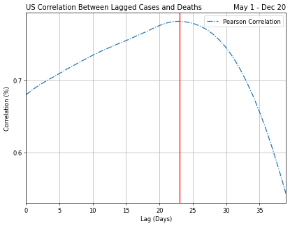
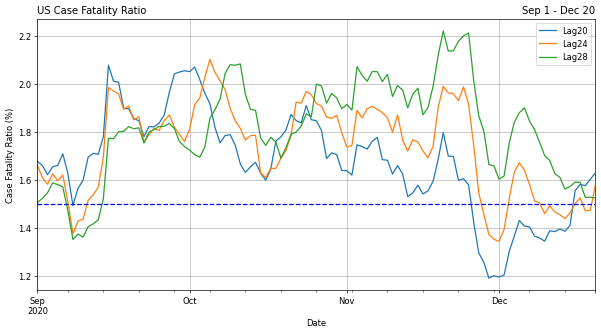
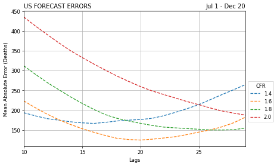

## Covid model comparison and forecasting death predictions
### Overview

* Model comparison looks at various time series to forecast future deaths.  
* While confirmed case levels have received mixed coverage, the number of deaths have served as a stark reminder of the virus severity and thus a more meaningful indicator of our social trajectory, if not economic one.
* Read in latest US Covid-19 confirmed cases and deaths from the following github repo:  COVID-19 Data Repository by the Center for Systems Science and Engineering (CSSE) at Johns Hopkins University
* Optmized time series forecasting and compared US death prediction models including ARIMA, SARIMAX, Prophet, XGBOOST and Neural Networks(NN)

### Code and Resources Used
Python Version: 3.7  
Environment: Google Colab  
Packages: pandas, numpy, statsmodels, sklearn, matplotlib, keras  
**Covid Modeling Comps code along** Compare time series predictions of COVID-19 deaths(https://www.coursera.org/projects/compare-time-series-predictions-of-covid19-deaths)
**Covid Case Fatality Ratio article** Delphi Research Group and the COVID tracking and forecasting (https://htmlpreview.github.io/?https://github.com/cmu-delphi/covidcast-modeling/blob/master/cfr_analysis/cfr_analysis.html)

### Data Cleaning
After reading in the data, it was necessary to transform the data to prepare it for modeling it in the formats required by the time series models.
* The dates columns were transposed and placed in a separate variable to later get added to a new dataframe
* The original dataset values are cumulative and in order to create a time series of incremental changes, the new dataset was differenced.
* The early dataset was quite sparse so for all models the time period was standardized to analyze from May through late December 2020.
* The dataset for XGBOOST and NN required datapoints to be treated as independent features and therefore needed to be extracted when building the test/train split.

### EDA
I looked at the case fataltity ratio and lagged correlations to understand the relationships that will drive the best predictions of future deaths.  Below are a few highlights:

### Model Building
Each forecast model had a couple unique elements to incorporate.  Each of these models were evaluated for its mean absolute error (MAE).  This measure was chosen because of its ease of interpretation and outliers aren't particularly disruptive to the model.

**SARIMAX**: First I tune the three hyperparameters that go into the order tuple to minimize the error. To do that, I used the auto_arima function from the Pyramid library for Python.  
**Prophet**: Facebook prophet does not require that we specify or search for hyperparameters as is the case with SARIMAX. Prophet requires the dataframe to have a column for the data ('y') and an index for dates ('ds').  
**XGBOOST and NN**: Both models required explicitly calling for the number of estimator iterations and epochs that will run through each model reducing the loss measures in successive steps.  
**ARIMA**: To improve upon the prior models, I lagged the confirmed cases and applied a case fatality ratio to establish the correlation between both variables and lags.  

### Model Performance
The ARIMA lag adjusted model performed the best and far outperformed the other approaches on the test and validation sets.
* **ARIMA 20-day lagged MAE**:  510.03
* **XGBOOST MAE**:  963.65
* **Prophet MAE**: 1066.65
* **SARIMA MAE**:  917.28
* **NN MAE**:  1015.08

